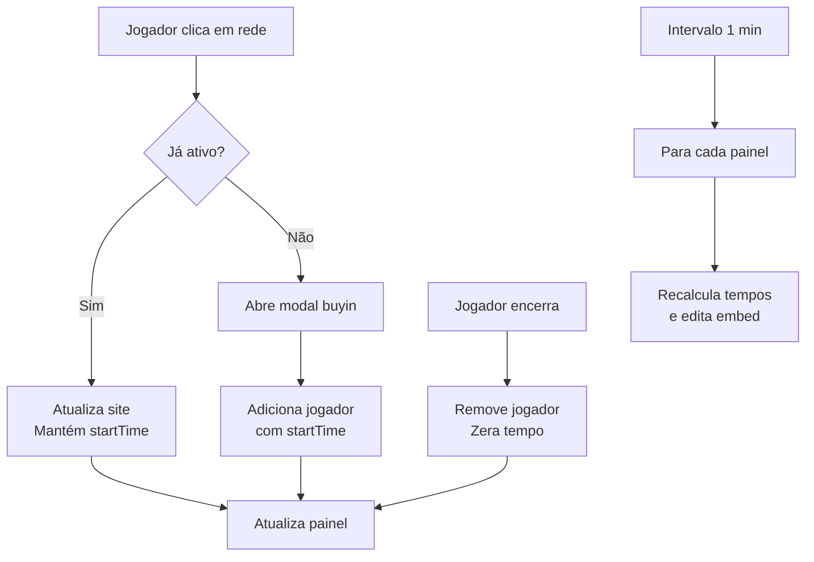

# Plano: Adicionar contador de tempo ao bot do Discord

## Objetivo
Adicionar um contador de tempo real ao lado de cada jogador no painel principal, atualizado a cada minuto. O tempo deve continuar contando quando o jogador muda de rede e zerar ao encerrar a sessão.

## Análise do código atual

- **Mapa `jogadoresAtivos`**: Armazena `{ site, buyin }` para cada userId.
- **Painel**: Embed gerado por `gerarPainelEmbed()`.
- **Interações**:
  - Botões de rede (`btn_rede_*`): se jogador não ativo, abre modal; se ativo, atualiza site.
  - Botão "Encerrar Sessão": remove jogador do mapa.
  - Modal de buyin: adiciona jogador ao mapa.
- **Atualização do painel**: Ocorre após qualquer interação que modifique `jogadoresAtivos`.

## Modificações necessárias

### 1. Estrutura de dados
Estender o objeto do jogador para incluir `startTime` (timestamp Unix em milissegundos).

```js
jogadoresAtivos.set(interaction.user.id, {
    site: pending.site,
    buyin: buyin,
    startTime: Date.now()
});
```

### 2. Função de formatação de duração
Criar função `formatarDuracao(ms)` que retorna string no formato "Xh Ym" ou "Xm Ys".

```js
function formatarDuracao(ms) {
    const segundos = Math.floor(ms / 1000);
    const minutos = Math.floor(segundos / 60);
    const horas = Math.floor(minutos / 60);
    if (horas > 0) {
        return `${horas}h ${minutos % 60}m`;
    } else if (minutos > 0) {
        return `${minutos}m ${segundos % 60}s`;
    } else {
        return `${segundos}s`;
    }
}
```

### 3. Atualizar `gerarPainelEmbed()`
Modificar a linha que monta cada entrada para incluir o tempo decorrido.

Exemplo de entrada atual:
```
${emoji} **<@${userId}>** | ${siteEmoji} **${dados.site}** | 💰 **${dados.buyin}**
```

Nova entrada:
```
${emoji} **<@${userId}>** | ${siteEmoji} **${dados.site}** | 💰 **${dados.buyin}** | ⏱️ **${formatarDuracao(Date.now() - dados.startTime)}**
```

Limite de caracteres: o campo já é limitado a 1024 caracteres; adicionar o tempo pode aumentar o comprimento. Manter truncamento existente.

### 4. Adicionar `startTime` ao adicionar jogador
No handler do modal (`interaction.isModalSubmit`), adicionar propriedade `startTime`.

### 5. Manter `startTime` ao mudar de rede
No handler do botão `btn_rede_*` quando jogador já está ativo, preservar `startTime` (apenas atualizar `site`).

### 6. Implementar intervalo de atualização automática
Adicionar um `setInterval` global (após login) que a cada minuto percorre todos os painéis registrados em `panelMessages` e os atualiza.

```js
function atualizarTodosPaineis() {
    panelMessages.forEach(async (messageId, channelId) => {
        try {
            const channel = await client.channels.fetch(channelId);
            const message = await channel.messages.fetch(messageId);
            await message.edit({ embeds: [gerarPainelEmbed()], components: gerarBotoes(), files: ['logo.jpg'] });
        } catch (error) {
            // Painel deletado, remover do mapa
            panelMessages.delete(channelId);
        }
    });
}

// Iniciar intervalo após client ready
client.once(Events.ClientReady, (c) => {
    console.log(`✅ Bot online! Logado como ${c.user.tag}`);
    setInterval(atualizarTodosPaineis, 60000); // 60 segundos
});
```

**Considerações de rate limit**: O Discord permite 5 edições por 5 segundos por canal. Como estamos editando cada painel a cada 60 segundos, está dentro do limite.

### 7. Atualizar `gerarStatsEmbed()` (opcional)
Pode-se adicionar tempo médio de sessão ou tempo total acumulado. Decidir conforme necessidade.

### 8. Testes
- Simular adição de jogador, verificar se startTime é salvo.
- Verificar se o tempo aparece no painel.
- Verificar se a atualização automática funciona (pode ser testado com intervalo menor em ambiente de teste).
- Verificar se ao mudar de rede o tempo não reinicia.
- Verificar se ao encerrar sessão o jogador some do painel.

### 9. Documentação
Atualizar `COMO-EXECUTAR.md` se necessário (nenhuma alteração de comando, apenas funcionalidade nova).

## Riscos
- Perda de `startTime` em reinicialização do bot (memória volátil). Se for necessário persistência, considerar armazenar em banco de dados (não solicitado).
- Erros de fetch de mensagem podem acumular; tratamento já implementado.
- O embed pode ficar muito longo; garantir truncamento.

## Próximos passos
1. Criar função `formatarDuracao`.
2. Modificar `gerarPainelEmbed`.
3. Adicionar `startTime` no modal.
4. Ajustar botão de rede para manter `startTime`.
5. Implementar intervalo de atualização.
6. Testar.
7. Atualizar documentação.

## Diagrama de fluxo (Mermaid)

