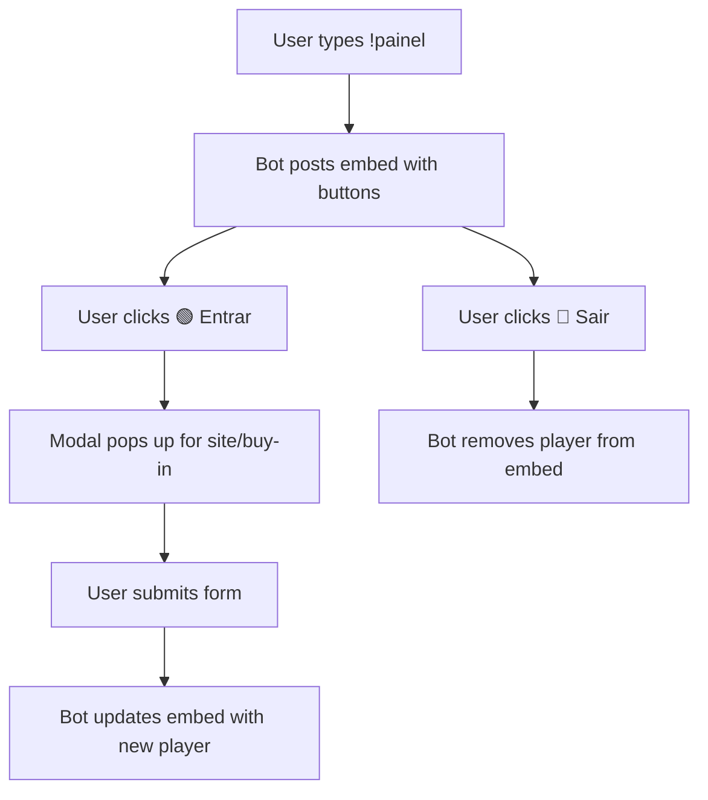
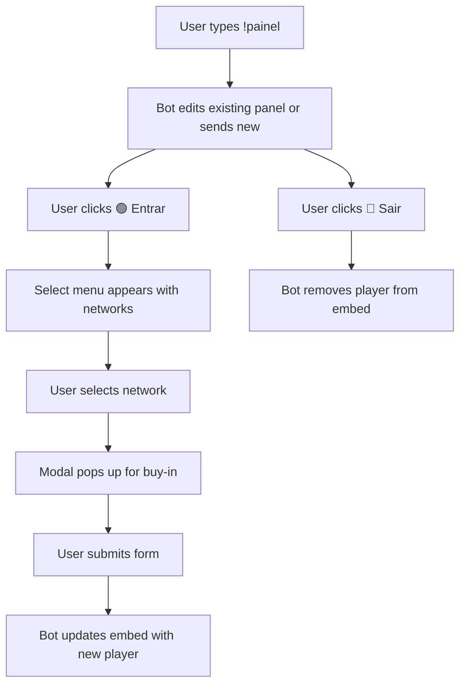

# Discord Poker Bot - Implementation Plan

## Overview
Create a Discord bot for the Elite Team Poker to manage player grinding sessions with a dynamic status panel.

## Requirements
- Node.js project with `discord.js` and `dotenv` dependencies
- Environment variable for bot token
- Single `index.js` file with the exact code provided
- Bot functionality:
  - `!painel` command to display interactive panel
  - Green button to start session (opens modal for site/buy-in)
  - Red button to end session
  - Real-time updates to embed showing active players

## File Structure
```
discord/
├── package.json
├── package-lock.json (auto-generated)
├── .env
├── index.js
└── README.md (optional)
```

## Implementation Steps

### 1. Initialize Node.js Project
- Create `package.json` with basic metadata and scripts
- Set `"type": "commonjs"` (since code uses `require`)
- Add `"main": "index.js"`

### 2. Install Dependencies
```bash
npm install discord.js dotenv
```

### 3. Create Environment File
- Create `.env` with placeholder token:
```
TOKEN_DO_BOT=cole_seu_token_aqui
```
- Add `.env` to `.gitignore` (optional)

### 4. Create Bot Code
- Create `index.js` with the exact code provided
- Ensure intents are correctly set (GatewayIntentBits)
- Verify Map usage for active players

### 5. Additional Enhancements (Optional)
- Add `start` script to `package.json`: `"start": "node index.js"`
- Create `.gitignore` to exclude `node_modules`, `.env`
- Create a simple `README.md` with usage instructions

## Bot Workflow



## Validation Steps
1. Verify `package.json` includes correct dependencies
2. Ensure `.env` is present with placeholder token
3. Test bot locally with a real token (user responsibility)
4. Confirm button interactions work as expected

## Next Steps
1. Switch to Code mode to implement the plan
2. Execute each step sequentially
3. Provide user with instructions to add bot token and run bot

## Notes
- The bot uses Discord.js v14 (intents required)
- Player data is stored in-memory (resets on bot restart)
- No database persistence needed for MVP
- Bot requires `MessageContent` intent enabled in Discord Developer Portal

## Enhancements Phase 2

### Visual Improvements
- Increase prominence of player names using **bold** and larger emojis.
- Add site icon (🌐) before site name.
- Add money‑related color to buy‑in (💰 emoji, green text via embed color).
- Improve spacing between player entries (already implemented).

### Panel Message Management
- Store panel message ID per channel to allow editing instead of creating duplicates.
- Modify `!painel` command to edit existing panel message if available; otherwise send new.
- Handle missing message (deleted) by sending a new panel.

### Network Selection Dropdown
- Replace free‑text site input with a select menu (StringSelectBuilder) containing predefined networks:
  - ChampionPoker
  - 888Poker
  - PokerStars
  - WPN
  - Poker King
- Interaction flow:
  1. User clicks "Entrar no Grind" → displays ephemeral select menu.
  2. User selects a network → store selection and show modal for buy‑in.
  3. User submits buy‑in → add player with selected network and buy‑in.
- Update embed display to show network with icon.

### Implementation Steps
1. Add global Map `panelMessages` to store `channelId → messageId`.
2. Update `!painel` handler to edit/ send accordingly.
3. Create select‑menu component with `StringSelectBuilder`.
4. Add new interaction handler for select menu (`interaction.isStringSelectMenu()`).
5. Store selected network in temporary Map `pendingSelections`.
6. Show modal for buy‑in after selection.
7. Update `gerarPainelEmbed` to format player entries with **bold** names, 🌐 icon, 💰 emoji.
8. Test thoroughly.

### Updated Workflow Diagram


### Validation
- Ensure select menu appears and works.
- Verify panel message is edited, not duplicated.
- Confirm visual enhancements appear correctly.
- Test edge cases (deleted panel, multiple channels).